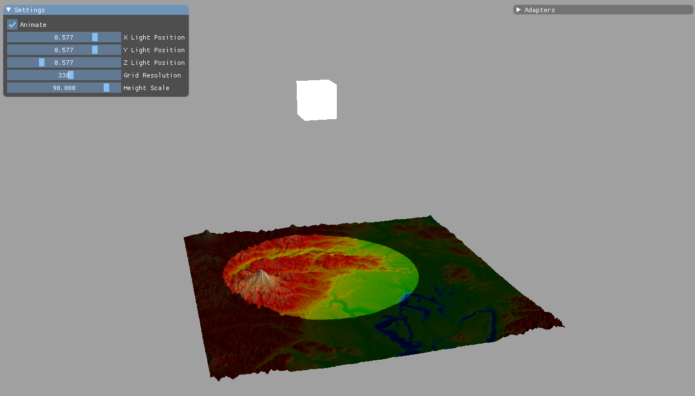

# TerrainRenderer Project

First experiment with Diligent Engine, small terrain renderer using height map feature. Demo includes "lamp light" with simple diffuse lighting model.

Imgui allows user to modify:
- position of the lamp above the map 
- number of points on the grid
- height scale

User can also zoom in/out with the mouse wheel

